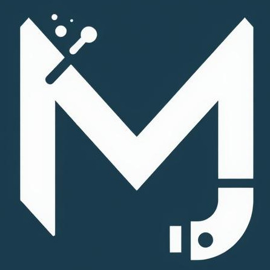

<p align="center">
  
</p>

<h1 align="center">🌊 DiveWeb</h1>

<p align="center">
  A personal website and diving portfolio built with <a href="https://nextjs.org" target="_blank">Next.js</a>.
</p>

---

## ✨ Overview

DiveWeb is a personal website created by **Michele Di Giorgio** to share diving experiences, photography, and personal insights.  
It’s built with **Next.js**, styled with **Material UI**, and uses **Auth0** for authentication and **Supabase** for storing user reviews.

---

## 🧰 Tech Stack

- **Framework:** [Next.js 14](https://nextjs.org)
- **UI:** [Material UI (MUI)](https://mui.com)
- **Auth:** [Auth0](https://auth0.com)
- **Database:** [Supabase](https://supabase.com)
- **Language:** TypeScript

---

## 🚀 Getting Started

### 1. Clone the repository

```bash
git clone https://github.com/mdigiorgio/diveweb.git
cd diveweb
```

### 2. Install dependencies

```bash
npm install
# or
yarn install
```

### 3. Start the development server

```bash
npm run dev
# or
yarn dev
```

Then open [http://localhost:3000](http://localhost:3000) with your browser to
see the result.

## License

The website source code is licensed under the [MIT License](./LICENSE).

## Content

All diving stories, images and resume © 2025 Michele Di Giorgio and are not
licensed for reuse.

<p align="center"> 🌊 Built with love and curiosity for the underwater world. </p>
